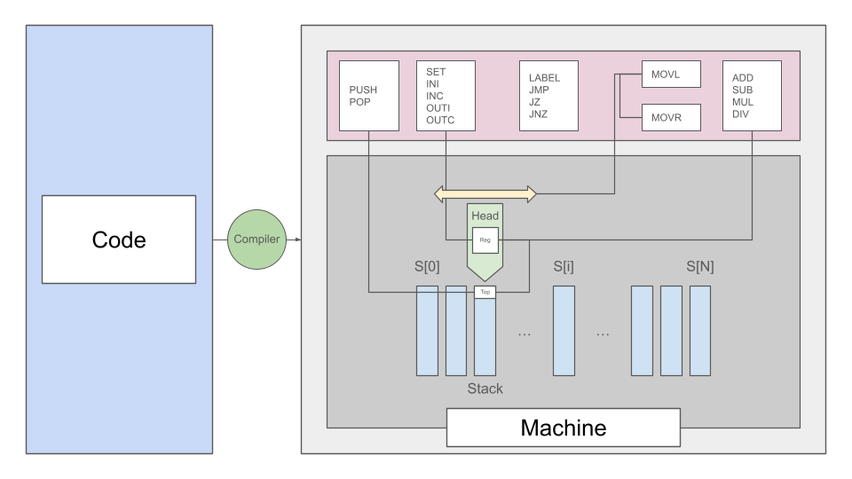

# PAL

## Introduction

PAL(Pushdown Automata Language) is a custom language that operates by simulating and instructing an imaginary Turing-complete N-stack Pushdown Automata.
 
The 'machine' consists of an array of N separate stacks, and a 'head' that can move left and right to point at different stacks to perform push and pop operations, equipped with a single 'register' that we use for I/O and basic addition/subtraction/multiplication/division.
As a meta-instruction, it also provides labels and jumps.
The machine is provably Turing-complete when N > 1 as it can use the stacks to replicate a tape by using one stack as the tape to the left side of the head and another as the right side of the head, and replicate the state table through labels and jumps.
  

  
The project aims to implement the machine, make it respond to the aforementioned basic instructions that guarentee completeness, and hopefully(with the help of AI) create a rudimentary compiler.
  

## Instruction Set

run with `java -cp out Main <file.pal> [nStacks]`

Comments start with `;` and run to the end of the line.

### Register / Arithmetic

| Instruction | Effect |
|-------------|--------|
| `SET n`     | `reg = n` |
| `INCR`      | `reg++` |
| `DECR`      | `reg--` |
| `ADD`       | `reg += pop(current stack)` |
| `SUB`       | `reg -= pop(current stack)` |
| `MUL`       | `reg *= pop(current stack)` |
| `DIV`       | `reg /= pop(current stack)` (integer division) |

### Stack

| Instruction | Effect |
|-------------|--------|
| `PUSH [n]`  | Push `n` (or `reg` if no argument) onto the current stack |
| `POP`       | Pop the top of the current stack into `reg` |
| `SWAP`      | Exchange `reg` with the top of the current stack |

### Head Movement

| Instruction | Effect |
|-------------|--------|
| `MOVL`      | Move the head one stack to the left |
| `MOVR`      | Move the head one stack to the right |

### I/O

| Instruction | Effect |
|-------------|--------|
| `OUTI`      | Print `reg` as an integer (with newline) |
| `OUTC`      | Print `reg` as an ASCII character (no newline) |
| `INI`       | Read one integer from stdin into `reg` |
| `INC`       | Read one character from stdin into `reg` (as its ASCII code) |

### Control Flow

`LABEL` is a directive resolved at load time and does not occupy a program counter slot.

| Instruction  | Effect |
|--------------|--------|
| `LABEL name` | Define a jump target named `name` |
| `JMP name`   | Unconditional jump to `name` |
| `JZ name`    | Jump to `name` if `reg == 0` |
| `JNZ name`   | Jump to `name` if `reg != 0` |

(just so we're clear, I didn't write this section myself; as I am not familiar with markdown syntax.)

---

by 22300608 Hyunseo Lee
