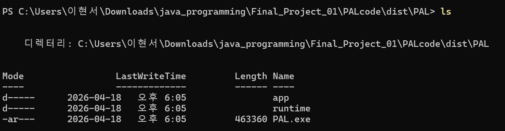
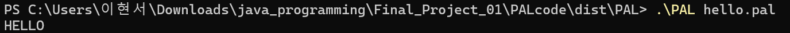
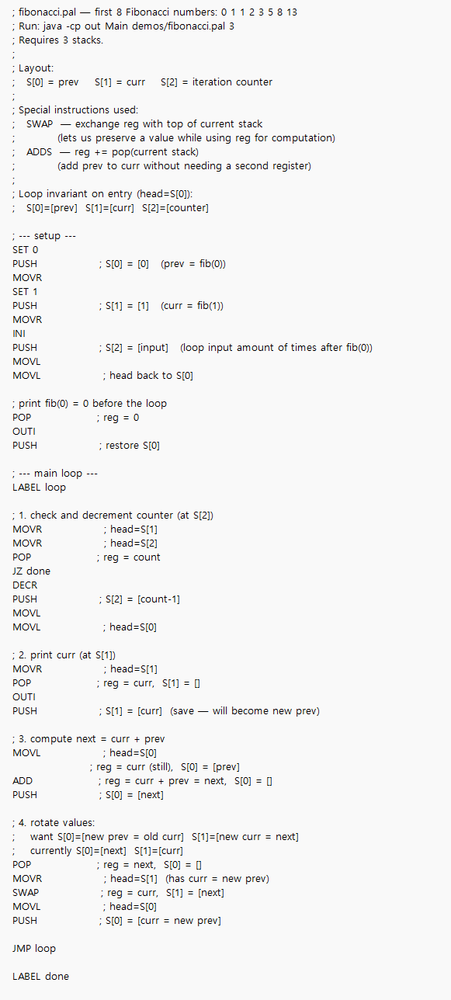

# PAL User Guide

## What is PAL?

PAL (Pushdown Automata Language) is a simple stack-based language that controls an imaginary N-stack machine with a movable head and a single register. It's Turing-complete when using more than one stack.

---

## Getting Started

### Option A — Use the pre-built executable (recommended)

1. Download `PAL.exe` from the Releases tab.
2. Open a terminal in the folder containing `PAL.exe`.

3. Run your program:
   ```
   PAL <filename.pal> [nStacks]
   ```
   - `filename.pal` — path to your PAL source file
   - `nStacks` — (optional) number of stacks, default is 2

### Option B — Run from source

1. Compile the Java source files:
   ```
   javac -d out src/*.java
   ```
2. Run your program:
   ```
   java -cp out Main <filename.pal> [nStacks]
   ```

---

## Writing a PAL Program

PAL source files use the `.pal` extension. Comments start with `;`.

**Example — Hello World (`hello.pal`)**
```
; Print HELLO
SET 72
OUTC    ; H
SET 69
OUTC    ; E
SET 76
OUTC    ; L
SET 76
OUTC    ; L
SET 79
OUTC    ; O
SET 10
OUTC    ; newline
```

Run it:
```
PAL hello.pal
```



---

## Instruction Reference (Quick Summary)

| Category      | Instructions                       |
|---------------|------------------------------------|
| Register      | `SET n`, `INCR`, `DECR`            |
| Arithmetic    | `ADD`, `SUB`, `MUL`, `DIV`         |
| Stack         | `PUSH [n]`, `POP`, `SWAP`          |
| Head movement | `MOVL`, `MOVR`                     |
| I/O           | `INI`, `INC`, `OUTI`, `OUTC`       |
| Control flow  | `LABEL name`, `JMP`, `JZ`, `JNZ`  |

For the full instruction reference, see [README.md](README.md).

Here is an example program that prints out the first n elements of the fibonacci sequence.


